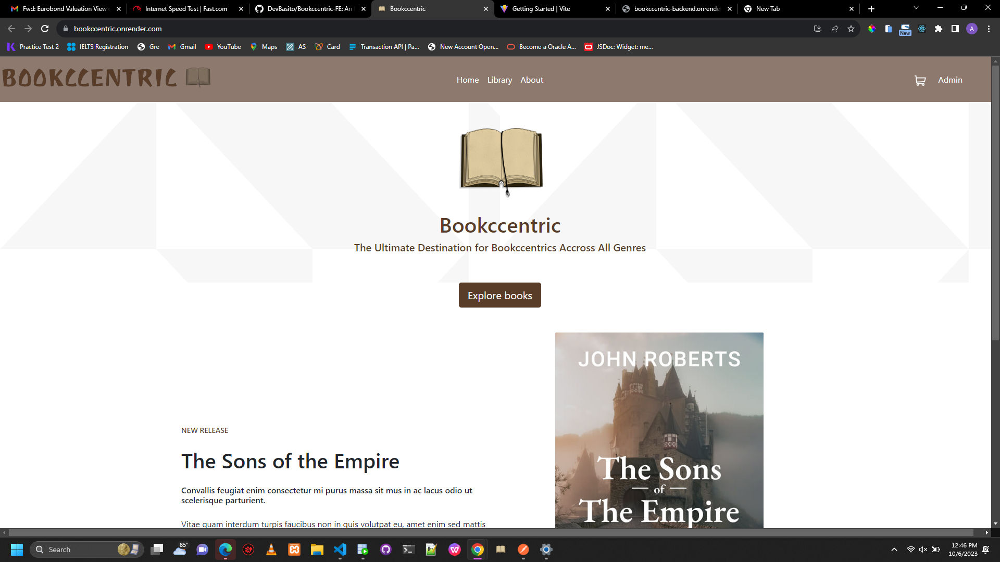
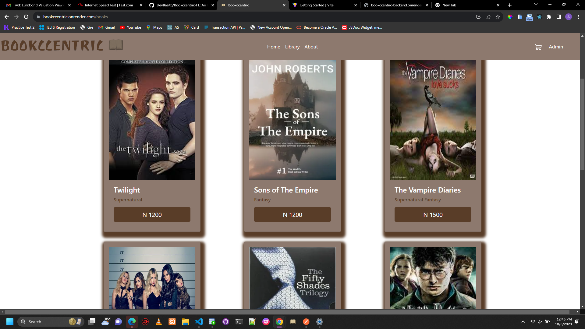

# Bookccentric-FE
An E-Bookstore Web Application

## Overview

This project was bootstrapped with [Vite React App](https://Vitejs.dev).
### The challenge

### Screenshot

### Links

- Solution URL: [https://github.com/DevBasito/Bookccentric-FE]
- Live Site URL: [https://bookccentric.onrender,com/]
- Server URL: [https://bookccentric-backend.onrender.com/]

## My process

### Built with

- [React](https://reactjs.org/) - JS library
- Semantic HTML5 markup
- CSS custom properties
- BootStrap 5
- Flexbox
- CSS Grid
- Mobile-Friendly workflow
- Responsive Design
- Progressive Web App (PWA)
- React Routers
- Redux Toolkit
- Vite 
- PayStack Payment Gateway
  

## Author
- ADERINWALE "BAXX" BASIT  @DevBasito
- Portfolio Website - (https://www.devbasito.netlify.app)
- Frontend Mentor - [@DevBasito](https://www.frontendmentor.io/profile/DevBasito)
- Twitter - [@baxx_v](https://www.twitter.com/baxx_v)

